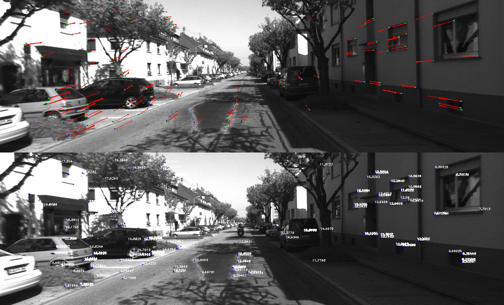

### test文件夹下测试文件说明：

### generate_edges_from_trajectory_origion.cpp
###### input: config/config.yaml
###### output: config/Edge_Candidates_index.txt
###### *Edge_Candidates_index.txt* Format

currentFrame.id lastFrame.id loopFrameCandidatesIndex.id... (eg:)
4477 4476 24 25 26 27 28

---
### motionestimate.cpp
###### Useage: ./motionestimate currentFrame.id lastFrame.id (eg:) KITTI sequence 00
./motionestimate 4477 28
you will see:
蓝色点为上一帧的keypoints 绿色点为当前帧的keypoints。
红色点为groundtruth投影到当前帧的点，红色连线是用groundtruth将上一帧2D点投影到当前帧与当前帧KeyPoints的连线，蓝色线为pnp或者ceres估计的位姿的连线。
##### Matches

##### Reprojection-ceres

##### Reprojection-pnp

---

### motionestimate_wholesequence.cpp
对整个序列做两帧之间的motionestimate

---
### pose_graph_ceres.cpp
这是比较初级的一个版本，针对KITTI 00序列做了测试，另外两帧之间的T结果使用的是pnp计算的结果.

---
### pose_graph_ceres_plus.cpp
回环帧之间的T计算方式改变，首先pnp获得inliers，然后用本质矩阵E从inliers里边恢复R，然后固定R和3D点，只优化t.

---
### pose_graph_ceres_plus_final.cpp
从config/Edge_Candidates_index.txt中读取Edge，但务必记得先生成该文件，生成该文件的方式见**generate_edges_from_trajectory_origion.cpp**

---
### After you run the pose_graph_ceres*.cpp. 
##### You can get result in the result/ folder. And you can run ./*.sh or ./*.py to see some results! Please see [result/PlotShow/README](../result/PlotShow/README.md)

